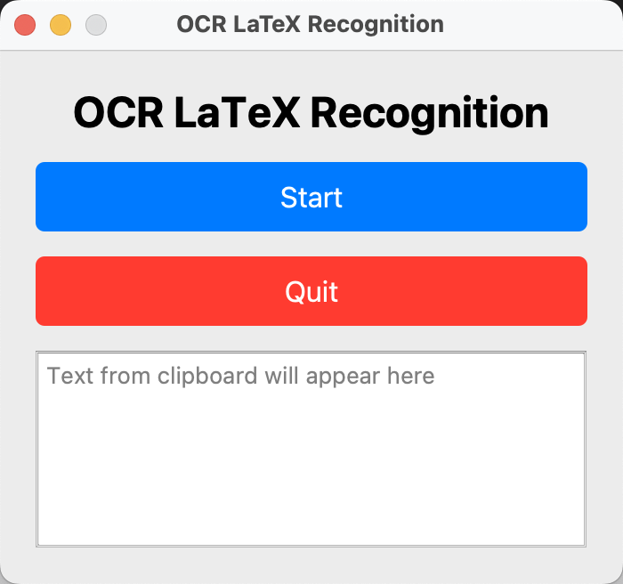
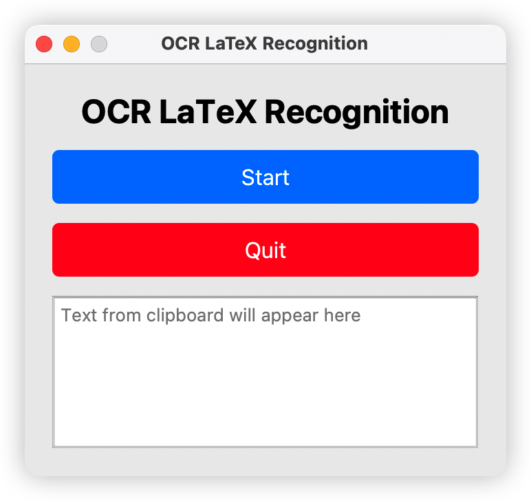
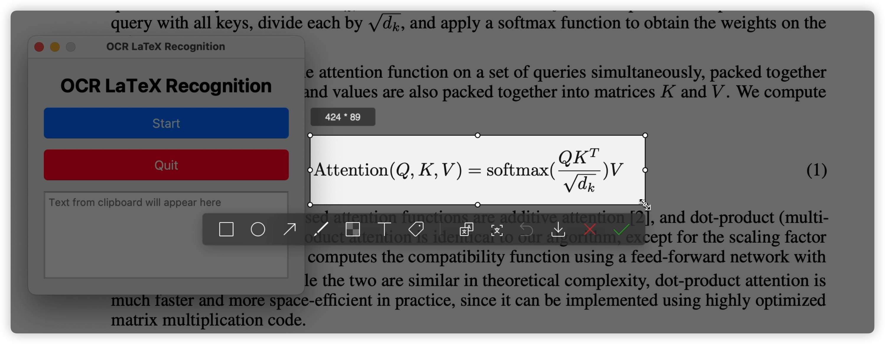
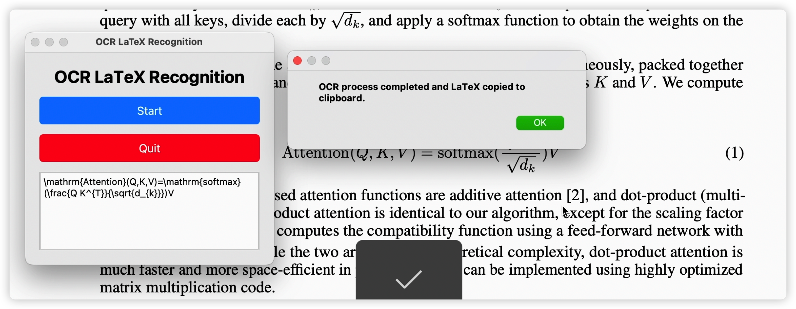
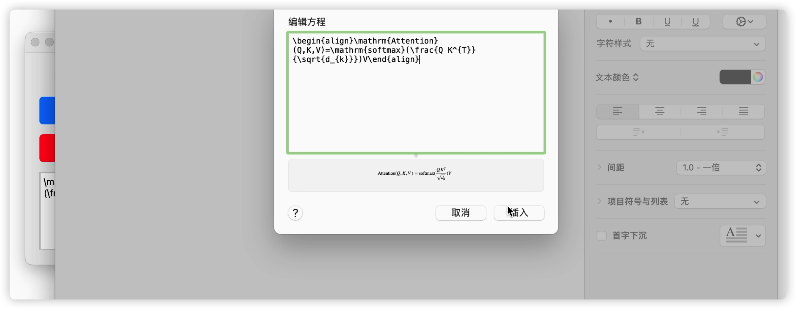

# Download for macos 
* download the macos_app.zip 
* unzip then click the app
* 
* then click start to start the app
* 
* it is really easy to use.
    * make a screen shot of the target formulas ( just need to make sure the screen shot is in the clipboard, it will automatically convert them into latex format.)
## A Pyqt program used to Latex Automatically Recognize
* environment Python 3.10.13
    * recommend to install [miniconda](https://docs.conda.io/projects/miniconda/en/latest/)
    * create Python 3.10.13 environment
    ```
    conda create -n myenv python=3.10.13
    conda activate myenv   
    ```
    
* using requirements.txt to install the python environment
```
pip install -r requirements.txt
```


* performance show
<video src="iShot_2023-10-12_02.13.26.mp4" controls title="Title"></video>
* using clipboard to show the result


* easy to paste 

* [video show](https://github.com/MysteriousL2019/Latex_OCR_Pyqt/issues/1#issue-1938460911)
